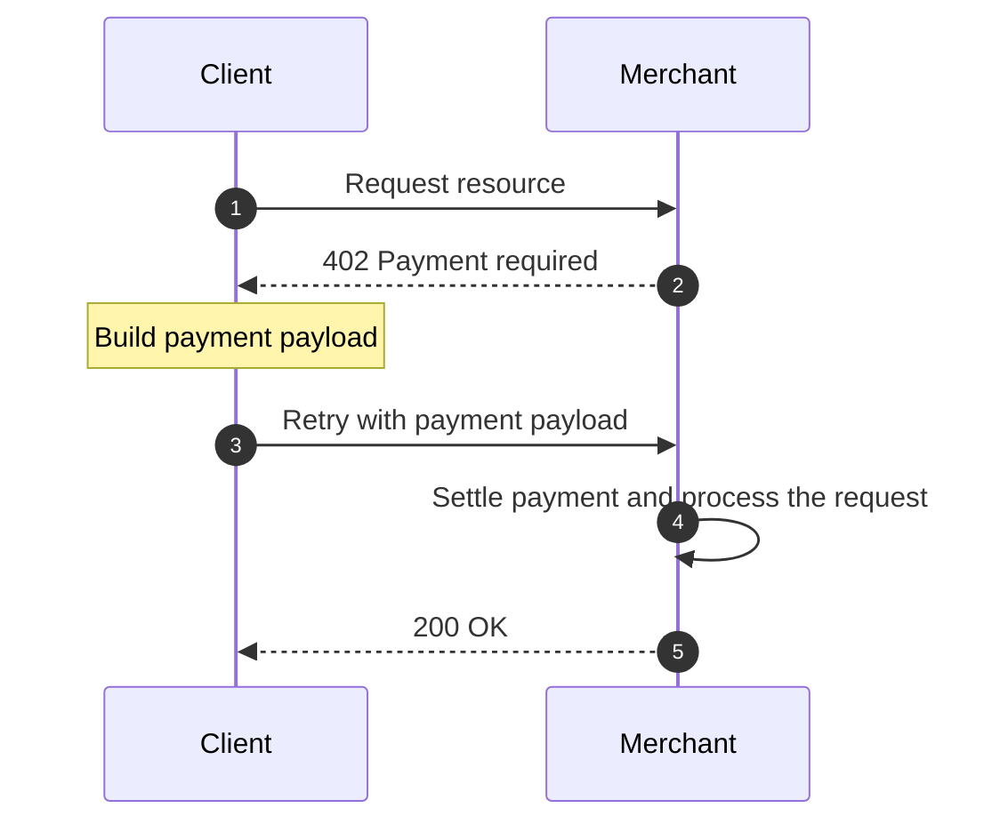
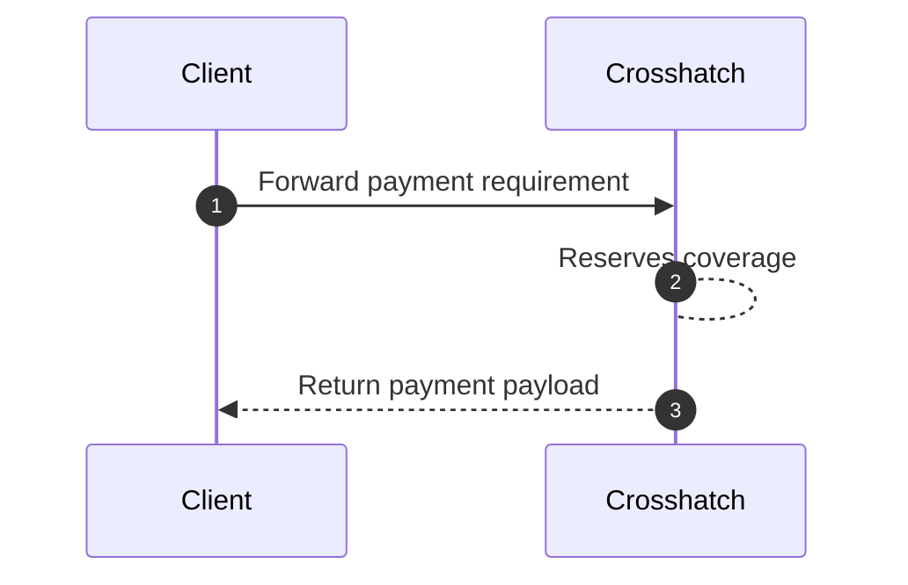

---

## Lifecycle at a Glance

Crosshatch automatically turns 402s into 200s.

<Steps>
<Step>

<h3>402 Forwarding</h3>

The client forwards the 402 to Crosshatch.

</Step>
<Step>

<h3>Reserves Coverage</h3>

Crosshatch reserves the required payment.

<Callout>

If unspent, this reservation is automatically released after the payload expiry.

</Callout>

</Step>
<Step>

<h3>Payment Generation</h3>

Crosshatch builds and returns a payment payload corresponding to the forwarded
requirement.

</Step>
<Step>

<h3>Retry Merchant</h3>

Crosshatch retries the initial request, this time with the Crosshatch-generated
payment attached.

</Step>
</Steps>

The end result: 402s are automatically converted into 200s, in a flow that works
across networks, tokens, and merchants.

---

## DX/UX Problem

Let's consider the non-Crosshatch-augmented 402 loop.

A client requests a resource, receives a 402 response, and must construct a
payment to include in a retry.



In this flow, developers are responsible for payment payload generation. This
step poses a barrier to entry for both developers and consumers.

---

## Crosshatch's Solution

Crosshatch abstracts over payment payload generation. Whenever a payment
requirement comes in, it can be automatically forwarded to Crosshatch to produce
a payment payload with which to retry.



---

## One-line Integration

In most cases, integration looks as follows.

```diff
+ import { fetch } from "crosshatch"

const response = fetch("https://some-paid-endpoint.com")
```

---
