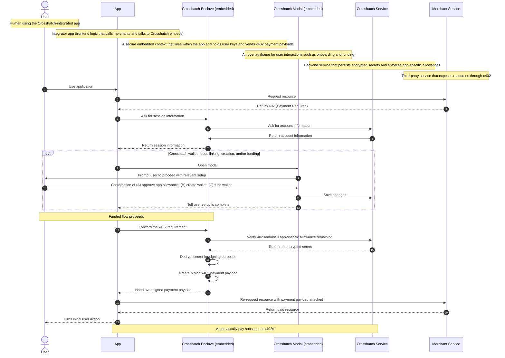

# Lifecycle

## Initial Request

The user triggers an action in the app. The app requests a resource from a merchant, which responds with a 402.

## Session Check

The app asks Crosshatch whether there an allowance has already been granted.

## Wallet Onboarding (if needed)

If the app lacks an allowances, a modal (or popup depending on browser) appears and guides the user through the
necessary steps: allowance approval and/or wallet funding. Once complete, the modal closes.

## Payment Signing

With a funded wallet and an active allowance, the app can forward x402 requirements to Crosshatch, which returns signed
payloads to the app. User's private keys never leave the Crosshatch enclave.

## Resource Delivery

The app retries the original request with the signed payment payload attached. The merchant verifies the payload and
returns the paid resource. The app fulfills the user's original action.

## Subsequent Payments

All future x402 payments within the user's allowance can be handled automatically — no further prompts necessary.

## Diagram

The full lifecycle of a Crosshatch session is as follows — from the initial user action through wallet setup, payment
signing, and resource delivery.

import { Expandable } from "../components/Expandable"

<Expandable>

</Expandable>
